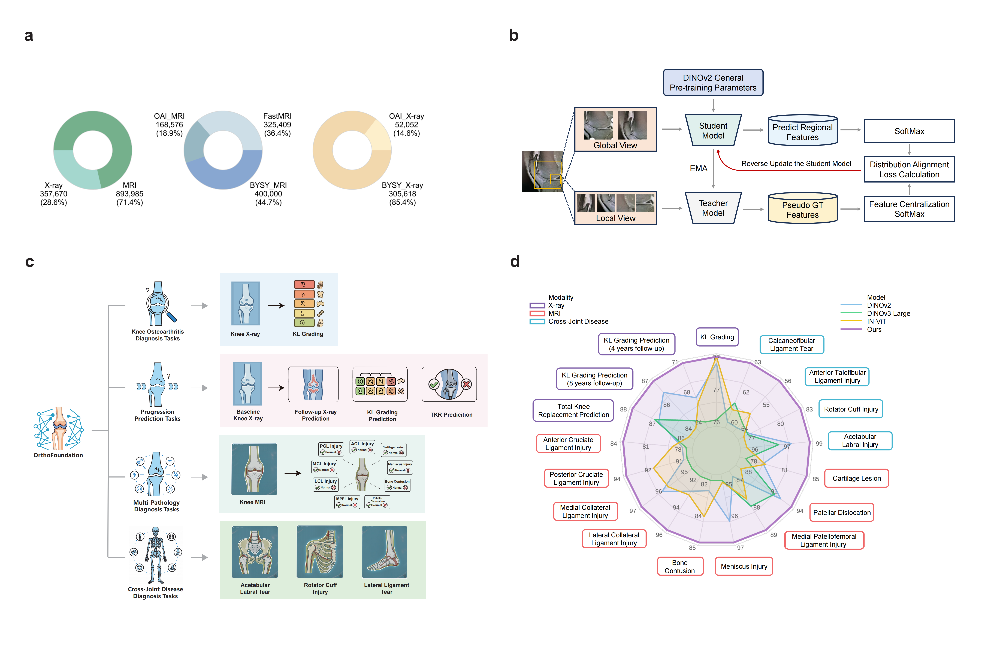

# OrthoFoundation-MSK-5M

OrthoFoundation is a large-scale multimodal vision foundation model for musculoskeletal diagnosis and prognosis. It was developed using self-supervised learning on knee and cross-joint imaging data, then evaluated across diagnostic, longitudinal prognostic, and cross-joint transfer tasks.

Training scripts, configuration files, and the expanded 5M-image pretrained checkpoint are released through this project repository.



*Figure 1. Overview of the pretraining corpus, student-teacher continued pretraining, downstream evaluation tasks, and comparison across 17 clinical tasks.*

## Paper

**OrthoFoundation: A large-scale multimodal vision foundation model for generalizable musculoskeletal diagnosis and prognosis**

Kang Yu, Dingyu Wang, Zimu Yuan, Nan Zhou, Yaoyan Zheng, Jiajun Liu, Jiaxin Liu, Shanggui Liu, Ruiqi Dong, Huijie Wang, Huishu Yuan, Di Huang, Dong Jiang.

The study pretrained OrthoFoundation on **1,251,655 knee images**, including **357,670 radiographs** and **893,985 MRI slices** from public repositories and a private multicenter cohort. The model was then fully fine-tuned and evaluated on **17 downstream tasks** covering knee X-ray, knee MRI, long-term osteoarthritis prognosis, and cross-joint transfer to the hip, shoulder, and ankle.

## Repository Layout

```text
OrthoFoundation-MSK-5M/
  OrthoFoundation-MSK-5M.pth  Released 5M-image musculoskeletal checkpoint
  datasets/              Dataset definitions and DINO augmentations
  exp/pretrain/           YAML configs for DINOv2 and DINOv3 pretraining
  metric/                 DINO loss and metric wrapper
  nets/                   ViT backbones, DINO head, multi-crop wrapper
  process/                Config-driven data/model/loss process builder
  tools/                  Training entry point and utility functions
  docs/figures/           Paper figures used by this README
```

## Installation

Create a Python environment with PyTorch, then install the remaining dependencies:

```bash
pip install -r requirements.txt
```

The experiments reported in the manuscript used CUDA 12.5 and 4 NVIDIA A100 GPUs.

## Data

The original self-supervised pretraining data were constructed by integrating public datasets with an internal clinical cohort. The corpus reported in the manuscript contains **1,251,655 knee images**, reported as 2D image counts:

- 357,670 knee radiographs
- 893,985 knee MRI slices

The public data include **600,000 knee imaging samples** from OAI and fastMRI. OAI contributed approximately 100,000 knee X-ray images and 200,000 knee MRI slices, while fastMRI contributed 300,000 knee MRI slices. The private cohort was retrospectively collected across four centers of Peking University Third Hospital Groups between December 2016 and June 2023 and includes knee X-ray images and MRI slices from 130,567 patients.

Publicly available datasets, including OAI and fastMRI, can be downloaded from their official repositories. The private clinical imaging data are available under restricted access to protect patient privacy and are subject to institutional review and data-sharing policies.

The checkpoint released in this repository was trained with an expanded corpus of approximately **5 million musculoskeletal images**, including about **4 million knee images** and **1 million cross-joint images** from the ankle, hip, and shoulder.

## Model

Backbone selection was performed using transferability estimation on the knee ACL injury task. The candidate backbones were evaluated with five transferability estimators: SFDA, PED, LogME, PARC, and ITM. DINOv3-L was selected based on its consistently strong ranking across these estimators.

OrthoFoundation uses a Vision Transformer backbone initialized with DINOv3-L weights. The model is adapted to orthopedic imaging through continued self-supervised pretraining on the expanded knee and cross-joint imaging corpus. The pretraining follows a DINO-style student-teacher framework: the teacher weights are updated as an exponential moving average of the student weights, the student processes local and global views, and the teacher observes global views.

## Model Weights

The expanded 5M-image pretrained weights are released in this repository as `OrthoFoundation-MSK-5M.pth`.

## Training

Experiments were implemented in PyTorch and trained on 4 NVIDIA A100 GPUs with CUDA 12.5. The reported training used batch size 32 and AdamW optimization with a cosine learning-rate schedule.

The training entry point in this repository is:

```bash
python tools/train.py --root <experiment_dir> --gpus 0
```

For distributed training:

```bash
torchrun --nproc_per_node=4 tools/train.py --root <experiment_dir> --gpus 0,1,2,3
```

The script reads `config.yaml` from the experiment directory passed to `--root`.

## Reported Evaluation

The manuscript evaluates the pretrained backbone after full fine-tuning. Selected results are shown below:

| Task | Modality | Metric | OrthoFoundation |
| --- | --- | --- | --- |
| KL grading | X-ray | Accuracy | 77.84 |
| KL grading prediction, 4-year follow-up | X-ray | Accuracy | 63.38 |
| KL grading prediction, 8-year follow-up | X-ray | Accuracy | 58.47 |
| Total knee replacement prediction | X-ray | AUROC | 82.17 |
| ACL injury | MRI | AUROC | 98.49 |
| PCL injury | MRI | AUROC | 84.31 |
| MCL injury | MRI | AUROC | 93.34 |
| Meniscus injury | MRI | Accuracy | 84.74 |
| Cartilage lesion | MRI | AUROC | 93.38 |
| Hip acetabular labral injury | MRI | AUROC | 83.66 |
| Shoulder supraspinatus tendon injury | MRI | Accuracy | 88.21 |
| Ankle ATFL injury | MRI | AUROC | 86.91 |
| Ankle CFL injury | MRI | AUROC | 70.62 |

The low-label experiments in the paper show that the pretrained model remains competitive when downstream training labels are reduced to 12.5%, including 94.39 AUROC for ACL injury detection.

## Citation

If this work is useful for your research, please cite:

```bibtex
@article{yu2026orthofoundation,
  title   = {OrthoFoundation: A large-scale multimodal vision foundation model for generalizable musculoskeletal diagnosis and prognosis},
  author  = {Yu, Kang and Wang, Dingyu and Yuan, Zimu and Zhou, Nan and Zheng, Yaoyan and Liu, Jiajun and Liu, Jiaxin and Liu, Shanggui and Dong, Ruiqi and Wang, Huijie and Yuan, Huishu and Huang, Di and Jiang, Dong},
  year    = {2026}
}
```
